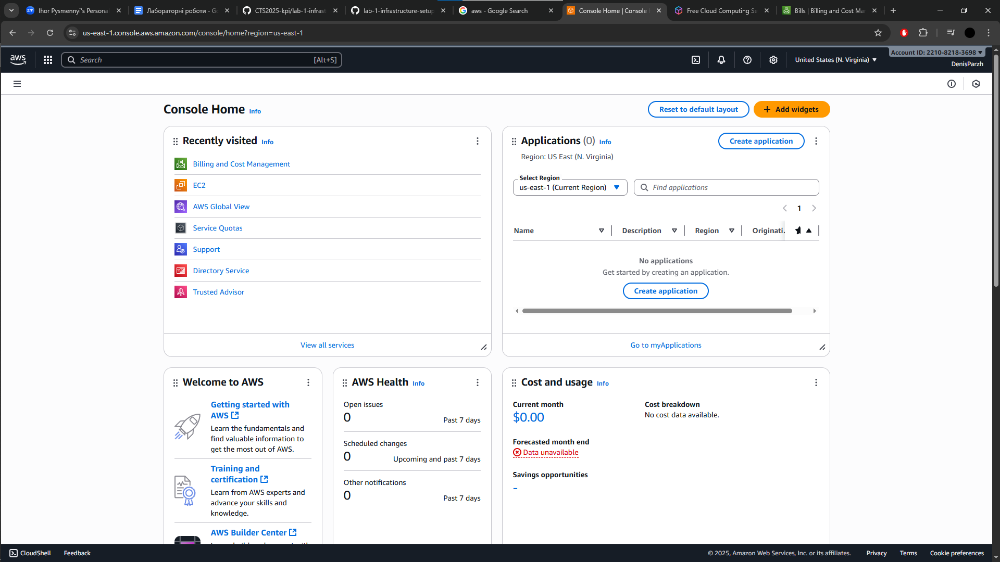
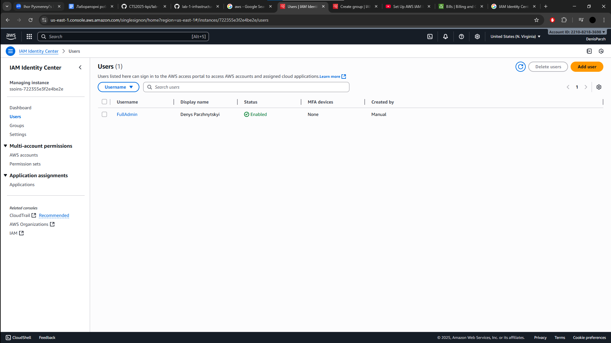
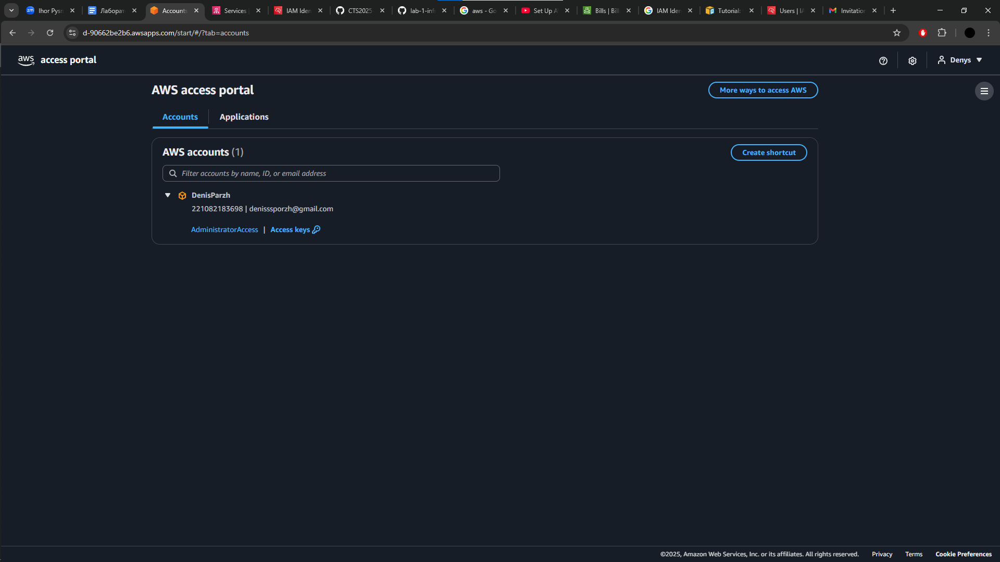
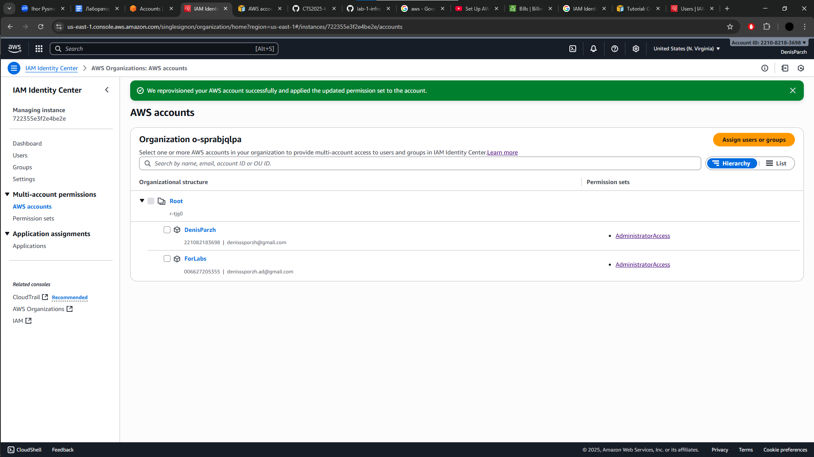
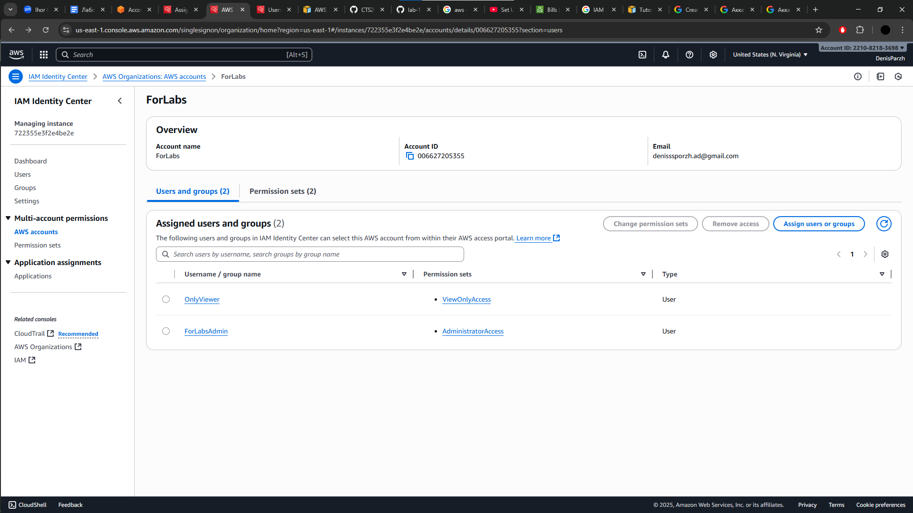
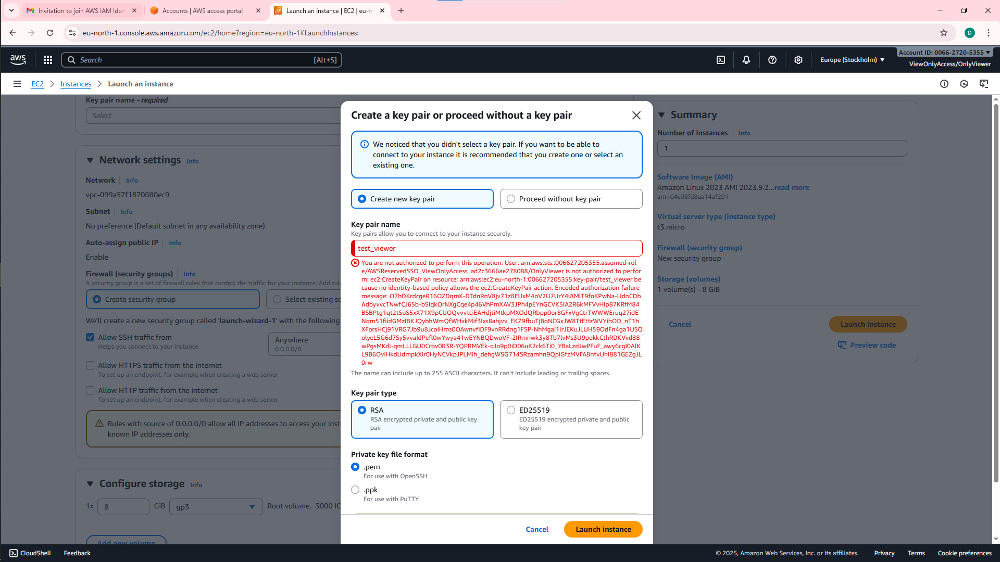
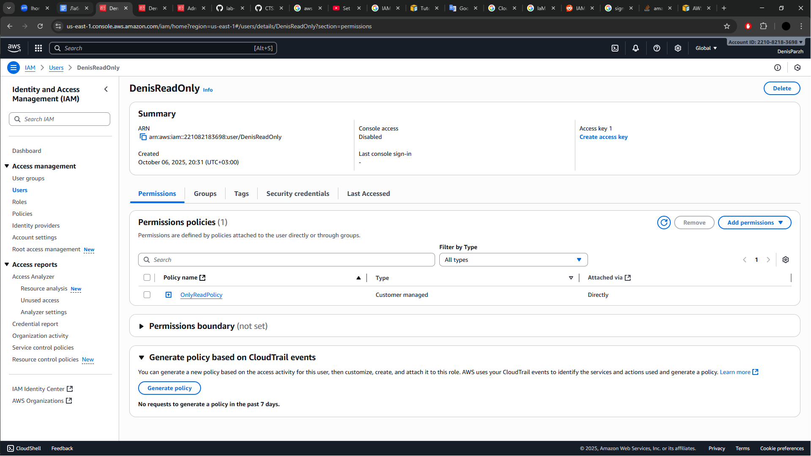
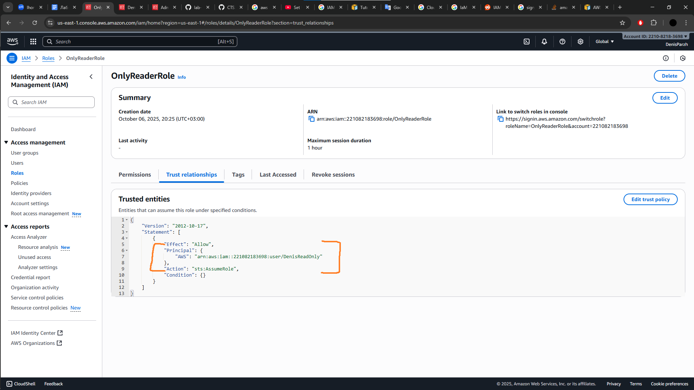
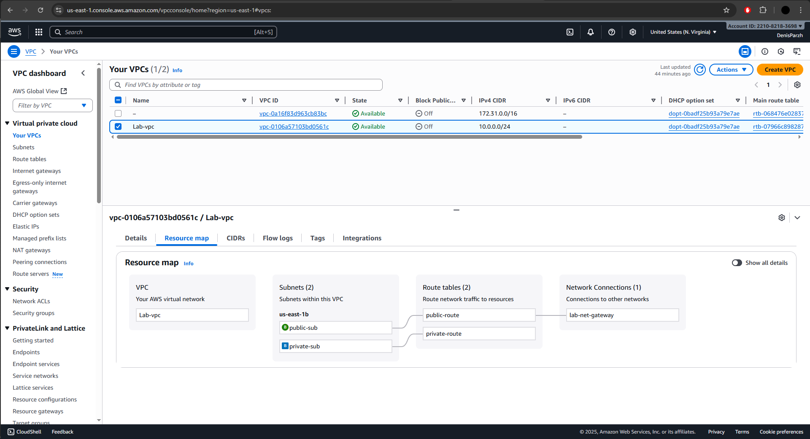
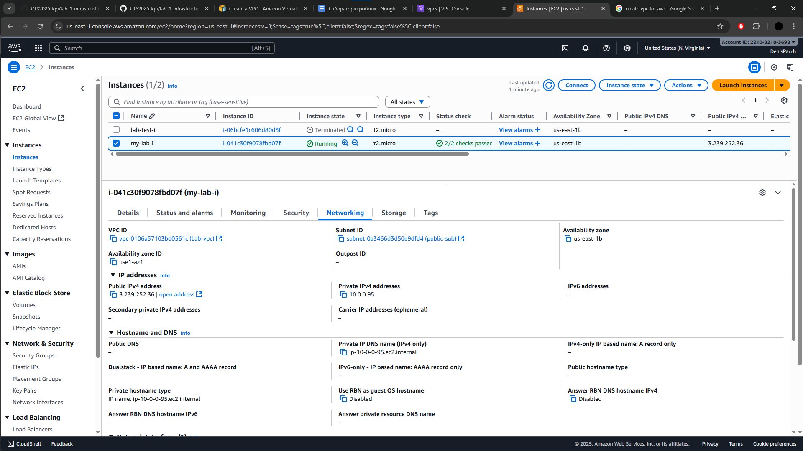

# Report Lab №1

## Task 1
Створюємо AWS аккаунт з root user. За допомогою IaM Identity Center створюю/додаю користувача  
з адмінськими правами.  

Новий користувач

Додавання нового користувача через IaM IC

Перевірка користувача за допомогою AWS access portal

## Task 2

Створюємо організацію та новий account _ForLabs_.

## Task 3

Додаємо до тільки-но створеного акаунту нового користувача з permission set на  
View Only.  

Новий користувач з правами перегляду

Перевірка, що він не може нічого створити/змінити

## Task 4

Створюю в IaM додаткового користувача з OnlyReadPolicy.

По завданню треба зробити щоб він міг assume role.

## Task 5

Створюємо cloudformation template на наші ролі та хто може assume. Також перевіряємо.
  

## Task 6

Створюємо VPC та додатково до неї: subnets, route tables, igw. 

Як результат створюємо інстанс на нашому vpc без проблем.

## Task 7 

Розрахувати бюджет на другу лабу. Беру 720 годин = 1 місяць.

- EC2 coordinator, наприклад t3.small (linux base) = 0.0208 * 720 = 14.97$
- x2 EC2 t3.medium (shards) = 0.06 * 2 * 720 = 86.4$
- gp3/gp2 EBS Volumes X2 (20 gb) = 20 * 0.09 = 1.8$
- Results: 103.17$